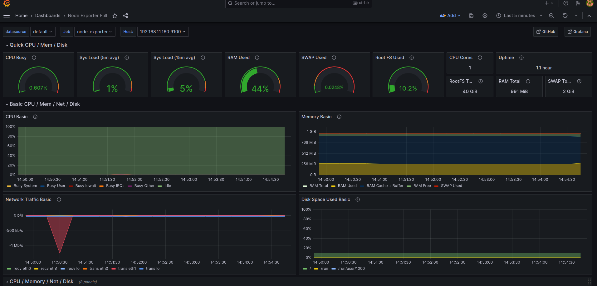

# Настройка мониторинга

> развернуть стенд с prometheus, grafana и node-exporter

> в grafana настроить дашборд с 4-мя графиками

```
память
процессор
диск
сеть
```

> развернем стенд с автоматической установкой prometheus, grafana и node-exporter

> 