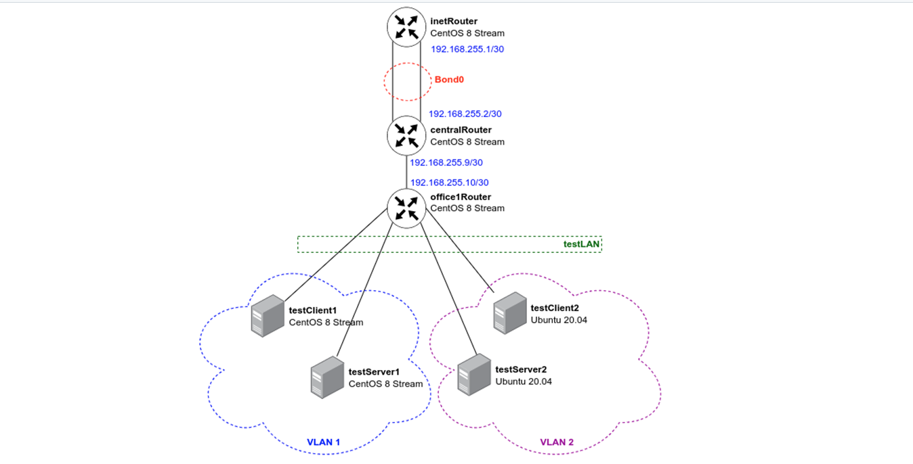

# Vagrant-стенд c VLAN и LACP


> Скачаем локально образ centos/stream8 (автоматическое скачивание не работает для centos8). Добавим скаченный образ в библиотеку vagrant.


```
wget https://cloud.centos.org/centos/8-stream/x86_64/images/CentOS-Stream-Vagrant-8-20230501.0.x86_64.vagrant-virtualbox.box
vagrant box add centos/stream8 /home/maikltim/CentOS-Stream-Vagrant-8-20230501.0.x86_64.vagrant-virtualbox.box
```

Развернем инфраструктуру с помомощью Vagrantfile:
```
# -*- mode: ruby -*-
# vim: set ft=ruby :

MACHINES = {
  :inetRouter => {
        :box_name => "centos/stream8",
        #:box_version => "20210210.0",
        :vm_name => "inetRouter",
        :net => [
                   {adapter: 2, auto_config: false, virtualbox__intnet: "router-net"},
                   {adapter: 3, auto_config: false, virtualbox__intnet: "router-net"},
                   {ip: '192.168.56.10', adapter: 8},
                ]
  },
  :centralRouter => {
        :box_name => "centos/stream8",
        #:box_version => "20210210.0",
        :vm_name => "centralRouter",
        :net => [
                   {adapter: 2, auto_config: false, virtualbox__intnet: "router-net"},
                   {adapter: 3, auto_config: false, virtualbox__intnet: "router-net"},
                   {ip: '192.168.255.9', adapter: 6, netmask: "255.255.255.252", virtualbox__intnet: "office1-central"},
                   {ip: '192.168.56.11', adapter: 8},
                ]
  },

  :office1Router => {
        :box_name => "centos/stream8",
        #:box_version => "20210210.0",
        :vm_name => "office1Router",
        :net => [
                   {ip: '192.168.255.10', adapter: 2, netmask: "255.255.255.252", virtualbox__intnet: "office1-central"},
                   {adapter: 3, auto_config: false, virtualbox__intnet: "vlan1"},
                   {adapter: 4, auto_config: false, virtualbox__intnet: "vlan1"},
                   {adapter: 5, auto_config: false, virtualbox__intnet: "vlan2"},
                   {adapter: 6, auto_config: false, virtualbox__intnet: "vlan2"},
                   {ip: '192.168.56.20', adapter: 8},
                ]
  },

  :testClient1 => {
        :box_name => "centos/stream8",
        #:box_version => "20210210.0",
        :vm_name => "testClient1",
        :net => [
                   {adapter: 2, auto_config: false, virtualbox__intnet: "testLAN"},
                   {ip: '192.168.56.21', adapter: 8},
                ]
  },

  :testServer1 => {
        :box_name => "centos/stream8",
        #:box_version => "20210210.0",
        :vm_name => "testServer1",
        :net => [
                   {adapter: 2, auto_config: false, virtualbox__intnet: "testLAN"},
                   {ip: '192.168.56.22', adapter: 8},
            ]
  },

  :testClient2 => {
        :box_name => "ubuntu/focal64",
        #:box_version => "20220411.2.0",
        :vm_name => "testClient2",
        :net => [
                   {adapter: 2, auto_config: false, virtualbox__intnet: "testLAN"},
                   {ip: '192.168.56.31', adapter: 8},
                ]
  },

  :testServer2 => {
        :box_name => "ubuntu/focal64",
        #:box_version => "20220411.2.0",
        :vm_name => "testServer2",
        :net => [
                   {adapter: 2, auto_config: false, virtualbox__intnet: "testLAN"},
                   {ip: '192.168.56.32', adapter: 8},
                ]
  },

}

Vagrant.configure("2") do |config|

  MACHINES.each do |boxname, boxconfig|
    
    config.vm.define boxname do |box|
   
      box.vm.box = boxconfig[:box_name]
      box.vm.host_name = boxconfig[:vm_name]
      #box.vm.box_version = boxconfig[:box_version]

      config.vm.provider "virtualbox" do |v|
        v.memory = 1024
        v.cpus = 2
       end

      boxconfig[:net].each do |ipconf|
        box.vm.network "private_network", ipconf
      end

      box.vm.provision "shell", inline: <<-SHELL
        mkdir -p ~root/.ssh
        cp ~vagrant/.ssh/auth* ~root/.ssh
      SHELL
    end
  end
end
```

> Данный Vagrantfile развернёт 7 виртуальных машин: • 5 ВМ на CentOS 8 Stream • 2 ВМ на Ubuntu 20.04

> Хосты testClient1, testServer1, testClient2 и testServer2 находятся в одной сети (testLAN).

> Для использования Ansible, каждому хосту выделен ip-адрес из подсети 192.168.56.0/24.

>  

# 2. Предварительная настройка всех машин с помощью ansible

> Перейдем в папку ansible и создадим файл hosts.

```
[nets]
inetRouter ansible_host=192.168.56.10 ansible_user=vagrant ansible_ssh_private_key_file=../.vagrant/machines/inetRouter/virtualbox/private_key bond_ip=192.168.255.1
centralRouter ansible_host=192.168.56.11 ansible_user=vagrant ansible_ssh_private_key_file=../.vagrant/machines/centralRouter/virtualbox/private_key bond_ip=192.168.255.2
office1Router ansible_host=192.168.56.20 ansible_user=vagrant ansible_ssh_private_key_file=../.vagrant/machines/office1Router/virtualbox/private_key 
testClient1 ansible_host=192.168.56.21 ansible_user=vagrant ansible_ssh_private_key_file=../.vagrant/machines/testClient1/virtualbox/private_key vlan_id=1 vlan_ip=10.10.10.254
testServer1 ansible_host=192.168.56.22 ansible_user=vagrant ansible_ssh_private_key_file=../.vagrant/machines/testServer1/virtualbox/private_key vlan_id=1 vlan_ip=10.10.10.1
testClient2 ansible_host=192.168.56.31 ansible_user=vagrant ansible_ssh_private_key_file=../.vagrant/machines/testClient2/virtualbox/private_key vlan_id=2 vlan_ip=10.10.10.254
testServer2 ansible_host=192.168.56.32 ansible_user=vagrant ansible_ssh_private_key_file=../.vagrant/machines/testServer2/virtualbox/private_key vlan_id=2 vlan_ip=10.10.10.1
```

> Создадим файл provision.yml

```
- name: Base set up
  #Настройка производится на всех хостах
  hosts: all
  become: yes
  tasks:
  #Установка приложений на RedHat-based системах
  - name: install softs on CentOS
    yum:
      name:
        - vim
        - traceroute
        - tcpdump
        - net-tools
      state: present
      update_cache: true
    when: (ansible_os_family == "RedHat")
  
  #Установка приложений на Debiam-based системах
  - name: install softs on Debian-based
    apt:
      name: 
        - vim
        - traceroute
        - tcpdump
        - net-tools
      state: present
      update_cache: true
    when: (ansible_os_family == "Debian")
```

> Запустим provison.yml для предварительной настройки всех хостов.

```
cd ansible
ansible-playbook provision.yml
```

# 3. Настройка VLAN с помощью ansible

# Настройка VLAN 1 на хостах testClient1 и testServer1 (Centos)


> Создадим vlan1.yml

```

- name: set up vlan1
  #Настройка будет производиться на хостах testClient1 и testServer1
  hosts: testClient1,testServer1
  #Настройка производится от root-пользователя
  become: yes
  tasks:
  #Добавление темплейта в файл /etc/sysconfig/network-scripts/ifcfg-vlan1
  - name: set up vlan1
    template:
      src: ifcfg-vlan1.j2
      dest: /etc/sysconfig/network-scripts/ifcfg-vlan1
      owner: root
      group: root
      mode: 0644
  
  #Перезапуск службы NetworkManager
  - name: restart network for vlan1
    service:
      name: NetworkManager
      state: restarted
```

> Файл шаблона ifcfg-vlan1.j2 

```
VLAN=yes
TYPE=Vlan
PHYSDEV=eth1
VLAN_ID={{ vlan_id }}
VLAN_NAME_TYPE=DEV_PLUS_VID_NO_PAD
PROXY_METHOD=none
BROWSER_ONLY=no
BOOTPROTO=none
IPADDR={{ vlan_ip }}
PREFIX=24
NAME=vlan{{ vlan_id }}
DEVICE=eth1.{{ vlan_id }}
ONBOOT=yes
```

> Запустим настройку vlan1 на testClient1 и testServer1 

```
ansible-playbook vlan1.yml
```

> Подключимся к testClient1 и проверим testServer1

```
vagrant ssh testClient1
```

```
Last login: Mon Oct  9 10:42:36 2023 from 192.168.56.1
[vagrant@testClient1 ~]$ sudo -i 
[root@testClient1 ~]# ip a
1: lo: <LOOPBACK,UP,LOWER_UP> mtu 65536 qdisc noqueue state UNKNOWN group default qlen 1000
    link/loopback 00:00:00:00:00:00 brd 00:00:00:00:00:00
    inet 127.0.0.1/8 scope host lo
       valid_lft forever preferred_lft forever
    inet6 ::1/128 scope host 
       valid_lft forever preferred_lft forever
2: eth0: <BROADCAST,MULTICAST,UP,LOWER_UP> mtu 1500 qdisc fq_codel state UP group default qlen 1000
    link/ether 52:54:00:d3:81:c4 brd ff:ff:ff:ff:ff:ff
    altname enp0s3
    inet 10.0.2.15/24 brd 10.0.2.255 scope global dynamic noprefixroute eth0
       valid_lft 86353sec preferred_lft 86353sec
    inet6 fe80::5054:ff:fed3:81c4/64 scope link 
       valid_lft forever preferred_lft forever
3: eth1: <BROADCAST,MULTICAST,UP,LOWER_UP> mtu 1500 qdisc fq_codel state UP group default qlen 1000
    link/ether 08:00:27:6e:cc:ff brd ff:ff:ff:ff:ff:ff
    altname enp0s8
    inet6 fe80::ea1f:141d:7891:e7ab/64 scope link noprefixroute 
       valid_lft forever preferred_lft forever
4: eth2: <BROADCAST,MULTICAST,UP,LOWER_UP> mtu 1500 qdisc fq_codel state UP group default qlen 1000
    link/ether 08:00:27:70:0c:18 brd ff:ff:ff:ff:ff:ff
    altname enp0s19
    inet 192.168.56.21/24 brd 192.168.56.255 scope global noprefixroute eth2
       valid_lft forever preferred_lft forever
    inet6 fe80::a00:27ff:fe70:c18/64 scope link 
       valid_lft forever preferred_lft forever
5: eth1.1@eth1: <BROADCAST,MULTICAST,UP,LOWER_UP> mtu 1500 qdisc noqueue state UP group default qlen 1000
    link/ether 08:00:27:6e:cc:ff brd ff:ff:ff:ff:ff:ff
    inet 10.10.10.254/24 brd 10.10.10.255 scope global noprefixroute eth1.1
       valid_lft forever preferred_lft forever
    inet6 fe80::a00:27ff:fe6e:ccff/64 scope link 
       valid_lft forever preferred_lft forever
[root@testClient1 ~]# 
[root@testClient1 ~]# ping 10.10.10.1
PING 10.10.10.1 (10.10.10.1) 56(84) bytes of data.
64 bytes from 10.10.10.1: icmp_seq=1 ttl=64 time=0.669 ms
64 bytes from 10.10.10.1: icmp_seq=2 ttl=64 time=0.454 ms
64 bytes from 10.10.10.1: icmp_seq=3 ttl=64 time=0.980 ms
64 bytes from 10.10.10.1: icmp_seq=4 ttl=64 time=1.00 ms
64 bytes from 10.10.10.1: icmp_seq=5 ttl=64 time=1.01 ms
```

> Настройка VLAN 2 на хостах testClient2 и testServer2 (Ubuntu) 

```
- name: set up vlan2
  hosts: testClient2,testServer2
  become: yes
  tasks:
  - name: set up vlan2
    template:
      src: 50-cloud-init.yaml.j2
      dest: /etc/netplan/50-cloud-init.yaml 
      owner: root
      group: root
      mode: 0644

  - name: apply set up vlan2
    shell: netplan apply
    become: true
```

> Файл шаблона 50-cloud-init.yaml.j2

```
network:
    version: 2
    ethernets:
        enp0s3:
            dhcp4: true
     
        enp0s8: {}
    
    vlans:
        vlan{{ vlan_id }}:
          id: {{ vlan_id }}
          link: enp0s8
          dhcp4: no
          addresses: [{{ vlan_ip }}/24]
```

> Запустим настройку vlan2 на testClient2 и testServer2

```
ansible-playbook vlan2.yml
```

> Подключимся к testClient2 и проверим testServer2

```
vagrant ssh testClient2
Welcome to Ubuntu 20.04.5 LTS (GNU/Linux 5.4.0-128-generic x86_64)

 * Documentation:  https://help.ubuntu.com
 * Management:     https://landscape.canonical.com
 * Support:        https://ubuntu.com/advantage

  System information as of Mon Oct  9 10:51:05 UTC 2023

  System load:  0.0               Users logged in:          0
  Usage of /:   4.7% of 38.70GB   IPv4 address for enp0s19: 192.168.56.31
  Memory usage: 24%               IPv4 address for enp0s3:  10.0.2.15
  Swap usage:   0%                IPv4 address for vlan2:   10.10.10.254
  Processes:    119


166 updates can be applied immediately.
115 of these updates are standard security updates.
To see these additional updates run: apt list --upgradable

New release '22.04.3 LTS' available.
Run 'do-release-upgrade' to upgrade to it.


*** System restart required ***
Last login: Mon Oct  9 10:50:53 2023 from 192.168.56.1
vagrant@testClient2:~$ sudo -i
root@testClient2:~# ip a
1: lo: <LOOPBACK,UP,LOWER_UP> mtu 65536 qdisc noqueue state UNKNOWN group default qlen 1000
    link/loopback 00:00:00:00:00:00 brd 00:00:00:00:00:00
    inet 127.0.0.1/8 scope host lo
       valid_lft forever preferred_lft forever
    inet6 ::1/128 scope host 
       valid_lft forever preferred_lft forever
2: enp0s3: <BROADCAST,MULTICAST,UP,LOWER_UP> mtu 1500 qdisc fq_codel state UP group default qlen 1000
    link/ether 02:01:41:f3:ec:d8 brd ff:ff:ff:ff:ff:ff
    inet 10.0.2.15/24 brd 10.0.2.255 scope global dynamic enp0s3
       valid_lft 86377sec preferred_lft 86377sec
    inet6 fe80::1:41ff:fef3:ecd8/64 scope link 
       valid_lft forever preferred_lft forever
3: enp0s8: <BROADCAST,MULTICAST,UP,LOWER_UP> mtu 1500 qdisc fq_codel state UP group default qlen 1000
    link/ether 08:00:27:bf:21:97 brd ff:ff:ff:ff:ff:ff
    inet6 fe80::a00:27ff:febf:2197/64 scope link 
       valid_lft forever preferred_lft forever
4: enp0s19: <BROADCAST,MULTICAST,UP,LOWER_UP> mtu 1500 qdisc fq_codel state UP group default qlen 1000
    link/ether 08:00:27:1f:2a:91 brd ff:ff:ff:ff:ff:ff
    inet 192.168.56.31/24 brd 192.168.56.255 scope global enp0s19
       valid_lft forever preferred_lft forever
    inet6 fe80::a00:27ff:fe1f:2a91/64 scope link 
       valid_lft forever preferred_lft forever
5: vlan2@enp0s8: <BROADCAST,MULTICAST,UP,LOWER_UP> mtu 1500 qdisc noqueue state UP group default qlen 1000
    link/ether 08:00:27:bf:21:97 brd ff:ff:ff:ff:ff:ff
    inet 10.10.10.254/24 brd 10.10.10.255 scope global vlan2
       valid_lft forever preferred_lft forever
    inet6 fe80::a00:27ff:febf:2197/64 scope link 
       valid_lft forever preferred_lft forever
root@testClient2:~# 

root@testClient2:~# ping 10.10.10.1
PING 10.10.10.1 (10.10.10.1) 56(84) bytes of data.
64 bytes from 10.10.10.1: icmp_seq=1 ttl=64 time=0.998 ms
64 bytes from 10.10.10.1: icmp_seq=2 ttl=64 time=0.990 ms
64 bytes from 10.10.10.1: icmp_seq=3 ttl=64 time=0.385 ms
64 bytes from 10.10.10.1: icmp_seq=4 ttl=64 time=1.19 ms
```

# 4. Настройка LACP

> Настроим LACP между хостами inetRouter и centralRouter

> Создадим lacp.yml

```
- name: set up bond0
  hosts: inetRouter,centralRouter
  become: yes
  tasks:
  - name: set up ifcfg-bond0
    template:
      src: ifcfg-bond0.j2
      dest: /etc/sysconfig/network-scripts/ifcfg-bond0
      owner: root
      group: root
      mode: 0644
  
  - name: set up eth1,eth2
    copy: 
      src: "{{ item }}" 
      dest: /etc/sysconfig/network-scripts/
      owner: root
      group: root
      mode: 0644
    with_items:
      - ifcfg-eth1.j2
      - ifcfg-eth2.j2
  #Перезагрузка хостов 
  - name: restart hosts for bond0
    reboot:
      reboot_timeout: 3600
```

> Создадим файлы шаблонов для eth1 и eth2.

> ifcfg-eth1.j2

```
#Имя физического интерфейса
DEVICE=eth1
#Включать интерфейс при запуске системы
ONBOOT=yes
#Отключение DHCP-клиента
BOOTPROTO=none
#Указываем, что порт часть bond-интерфейса
MASTER=bond0
#Указыаваем роль bond
SLAVE=yes
NM_CONTROLLED=yes
USERCTL=no
```

> ifcfg-eth2.j2

```
#Имя физического интерфейса
DEVICE=eth2
#Включать интерфейс при запуске системы
ONBOOT=yes
#Отключение DHCP-клиента
BOOTPROTO=none
#Указываем, что порт часть bond-интерфейса
MASTER=bond0
#Указыаваем роль bond
SLAVE=yes
NM_CONTROLLED=yes
USERCTL=no
```

> Подключимся к inetRouter и проверим centralRouter, затем отключим eth1 на CentralRouter и проверим ping.


```
ip a
1: lo: <LOOPBACK,UP,LOWER_UP> mtu 65536 qdisc noqueue state UNKNOWN group default qlen 1000
    link/loopback 00:00:00:00:00:00 brd 00:00:00:00:00:00
    inet 127.0.0.1/8 scope host lo
       valid_lft forever preferred_lft forever
    inet6 ::1/128 scope host 
       valid_lft forever preferred_lft forever
2: eth0: <BROADCAST,MULTICAST,UP,LOWER_UP> mtu 1500 qdisc fq_codel state UP group default qlen 1000
    link/ether 52:54:00:d3:81:c4 brd ff:ff:ff:ff:ff:ff
    altname enp0s3
    inet 10.0.2.15/24 brd 10.0.2.255 scope global dynamic noprefixroute eth0
       valid_lft 86371sec preferred_lft 86371sec
    inet6 fe80::5054:ff:fed3:81c4/64 scope link 
       valid_lft forever preferred_lft forever
3: eth1: <BROADCAST,MULTICAST,SLAVE,UP,LOWER_UP> mtu 1500 qdisc fq_codel master bond0 state UP group default qlen 1000
    link/ether 08:00:27:5c:c8:1d brd ff:ff:ff:ff:ff:ff
    altname enp0s8
4: eth2: <BROADCAST,MULTICAST,SLAVE,UP,LOWER_UP> mtu 1500 qdisc fq_codel master bond0 state UP group default qlen 1000
    link/ether 08:00:27:2d:d6:ae brd ff:ff:ff:ff:ff:ff
    altname enp0s9
5: eth3: <BROADCAST,MULTICAST,UP,LOWER_UP> mtu 1500 qdisc fq_codel state UP group default qlen 1000
    link/ether 08:00:27:02:0f:58 brd ff:ff:ff:ff:ff:ff
    altname enp0s19
    inet 192.168.56.10/24 brd 192.168.56.255 scope global noprefixroute eth3
       valid_lft forever preferred_lft forever
    inet6 fe80::a00:27ff:fe02:f58/64 scope link 
       valid_lft forever preferred_lft forever
6: bond0: <BROADCAST,MULTICAST,MASTER,UP,LOWER_UP> mtu 1500 qdisc noqueue state UP group default qlen 1000
    link/ether 08:00:27:5c:c8:1d brd ff:ff:ff:ff:ff:ff
    inet 192.168.255.1/30 brd 192.168.255.3 scope global noprefixroute bond0
       valid_lft forever preferred_lft forever
    inet6 fe80::a00:27ff:fe5c:c81d/64 scope link 
       valid_lft forever preferred_lft forever
[vagrant@inetRouter ~]$ 
[vagrant@inetRouter ~]$ ping 192.168.255.2
PING 192.168.255.2 (192.168.255.2) 56(84) bytes of data.
64 bytes from 192.168.255.2: icmp_seq=1 ttl=64 time=0.693 ms
64 bytes from 192.168.255.2: icmp_seq=2 ttl=64 time=0.529 ms
64 bytes from 192.168.255.2: icmp_seq=3 ttl=64 time=0.966 ms
64 bytes from 192.168.255.2: icmp_seq=4 ttl=64 time=1.03 ms
```

> Не отменяя ping подключаемся к хосту centralRouter и выключаем там интерфейс eth1: 

```
vagrant ssh centralRouter
Last login: Mon Oct  9 11:10:18 2023 from 192.168.56.1
[vagrant@centralRouter ~]$ sudo -i
[root@centralRouter ~]# ip link set down eth1
```
> После данного действия ping не должен пропасть, так как трафик пойдёт по-другому порту.

```
[root@centralRouter ~]# ip link set up eth1
```