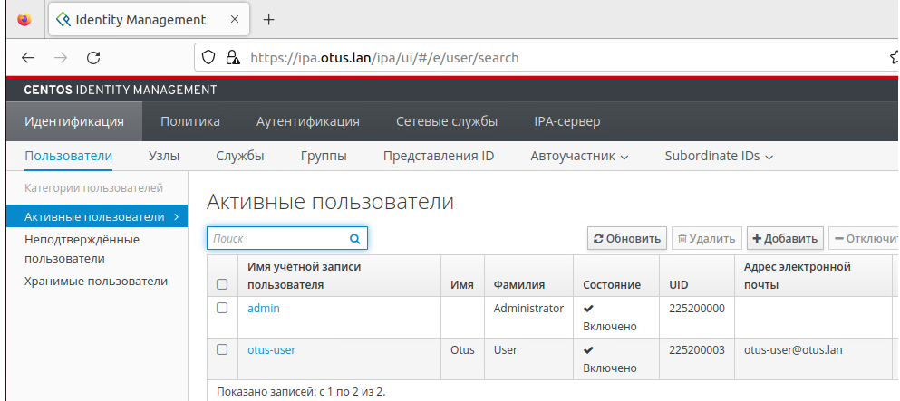

# Vagrant-стенд c LDAP на базе FreeIPA

```
Vagrant.configure("2") do |config|
    # Указываем ОС, версию, количество ядер и ОЗУ
    config.vm.box = "centos/stream8"
    #config.vm.box_version = "20210210.0"
 
    config.vm.provider :virtualbox do |v|
      v.memory = 2048
      v.cpus = 1
    end
  
    # Указываем имена хостов и их IP-адреса
    boxes = [
      { :name => "ipa.otus.lan",
        :ip => "192.168.57.10",
      },
      { :name => "client1.otus.lan",
        :ip => "192.168.57.11",
      },
      { :name => "client2.otus.lan",
        :ip => "192.168.57.12",
      }
    ]
    # Цикл запуска виртуальных машин
    boxes.each do |opts|
      config.vm.define opts[:name] do |config|
        config.vm.hostname = opts[:name]
        config.vm.network "private_network", ip: opts[:ip]
      end
    end
  end
```

# 2. Установка FreeIPA сервера

> Для начала нам необходимо настроить FreeIPA-сервер. Подключимся к нему по SSH с помощью команды:

```
vagrant ssh ipa.otus.lan
```
> и перейдём в root-пользователя:

```
sudo -i
```

> Начнём настройку FreeIPA-сервера:

> Установим часовой пояс: timedatectl set-timezone Europe/Moscow

> Установим утилиту chrony: yum install -y chrony

> Запустим chrony и добавим его в автозагрузку: systemctl enable chronyd --now

> Выключим Firewall: systemctl stop firewalld

> Отключим автозапуск Firewalld: systemctl disable firewalld

> Остановим Selinux: setenforce 0

> Поменяем в файле /etc/selinux/config, параметр Selinux на disabled

```
vi /etc/selinux/config

# This file controls the state of SELinux on the system

# SELINUX= can take one of these three values

# enforcing - SELinux security policy is enforced

# permissive - SELinux prints warnings instead of enforcing

# disabled - No SELinux policy is loaded

SELINUX=disabled

# SELINUXTYPE= can take one of these three values

# targeted - Targeted processes are protected

# minimum - Modification of targeted policy. Only selected processes are protected

# mls - Multi Level Security protection

SELINUXTYPE=targeted
```

> Для дальнейшей настройки FreeIPA нам потребуется, чтобы DNS-сервер хранил запись о нашем LDAP-сервере. В рамках данной лабораторной работы мы не будем
> настраивать отдельный DNS-сервер и просто добавим запись в файл /etc/hosts vi /etc/hosts

```
127.0.0.1   localhost localhost.localdomain
127.0.1.1 ipa.otus.lan ipa
192.168.57.10 ipa.otus.lan ipa
```

> Установим модуль DL1: yum install -y @idm:DL1

> Установим FreeIPA-сервер: yum install -y ipa-server

> Запустим скрипт установки: ipa-server-install

> Далее, нам потребуется указать параметры нашего LDAP-сервера, после ввода каждого параметра нажимаем Enter, если нас устраивает параметр, указанный в 
> квадратных скобках, то можно сразу нажимать Enter:

```
Do you want to configure integrated DNS (BIND)? [no]: no
Server host name [ipa.otus.lan]: <Нажимем Enter>
Please confirm the domain name [otus.lan]: <Нажимем Enter>
Please provide a realm name [OTUS.LAN]: <Нажимем Enter>
Directory Manager password: <Указываем пароль минимум 8 символов>
Password (confirm): <Дублируем указанный пароль>
IPA admin password: <Указываем пароль минимум 8 символов>
Password (confirm): <Дублируем указанный пароль>
NetBIOS domain name [OTUS]: <Нажимем Enter>
Do you want to configure chrony with NTP server or pool address? [no]: no
The IPA Master Server will be configured with:
Hostname:       ipa.otus.lan
IP address(es): 192.168.57.10
Domain name:    otus.lan
Realm name:     OTUS.LAN

The CA will be configured with:
Subject DN:   CN=Certificate Authority,O=OTUS.LAN
Subject base: O=OTUS.LAN
Chaining:     self-signed
Проверяем параметры, если всё устраивает, то нажимаем yes
Continue to configure the system with these values? [no]: yes
```

> При вводе параметров установки мы вводили 2 пароля: Directory Manager password — это пароль администратора сервера каталогов, У этого пользователя есть 
> полный доступ к каталогу. IPA admin password — пароль от пользователя FreeIPA admin

> После успешной установки FreeIPA, проверим, что сервер Kerberos может выдать нам билет:

```
[root@ipa ~]# kinit admin
Password for admin@OTUS.LAN: 
[root@ipa ~]# klist
Ticket cache: KCM:0
Default principal: admin@OTUS.LAN

Valid starting     Expires            Service principal
10/07/23 14:02:55  10/08/23 13:05:29  krbtgt/OTUS.LAN@OTUS.LAN
[root@ipa ~]# kdestroy
[root@ipa ~]# klist
klist: Credentials cache 'KCM:0' not found
```

> Для удаление полученного билета воспользуемся командой: kdestroy

> Мы можем зайти в Web-интерфейс нашего FreeIPA-сервера, для этого на нашей хостой машине нужно прописать следующую строку в файле Hosts: 192.168.57.10 ipa.
> otus.lan

```
echo "192.168.57.10 ipa.otus.lan" | sudo tee -a /etc/hosts
cat /etc/hosts
ping ipa.otus.lan
```

# 3. Подключение клиентов к freeipa с помощью ansible

> Создадим файл hosts

```
[clients]
client1.otus.lan ansible_host=192.168.57.11 ansible_user=vagrant ansible_ssh_private_key_file=../.vagrant/machines/client1.otus.lan/virtualbox/private_key
client2.otus.lan ansible_host=192.168.57.12 ansible_user=vagrant ansible_ssh_private_key_file=../.vagrant/machines/client2.otus.lan/virtualbox/private_key
```
> Создадим файл provision.yml для первоначальной настройки и подключения клиентов к freeipa service

```
- name: Base set up
  hosts: all
  #Выполнять действия от root-пользователя
  become: yes
  tasks:
  #Установка текстового редактора Vim и chrony
  - name: install softs on CentOS
    yum:
      name:
        - vim
        - chrony
      state: present
      update_cache: true
  
  #Отключение firewalld и удаление его из автозагрузки
  - name: disable firewalld
    service:
      name: firewalld
      state: stopped
      enabled: false
  
  #Отключение SElinux из автозагрузки
  #Будет применено после перезагрузки
  - name: disable SElinux
    selinux:
      state: disabled
  
  #Отключение SElinux до перезагрузки
  - name: disable SElinux now
    shell: setenforce 0

  #Установка временной зоны Европа/Москва    
  - name: Set up timezone
    timezone:
      name: "Europe/Moscow"
  
  #Запуск службы Chrony, добавление её в автозагрузку
  - name: enable chrony
    service:
      name: chronyd
      state: restarted
      enabled: true
  
  #Копирование файла /etc/hosts c правами root:root 0644
  - name: change /etc/hosts
    template:
      src: hosts.j2
      dest: /etc/hosts
      owner: root
      group: root
      mode: 0644
  
  #Установка клиента Freeipa
  - name: install module ipa-client
    yum:
      name:
        - freeipa-client
      state: present
      update_cache: true
  
  #Запуск скрипта добавления хоста к серверу
  - name: add host to ipa-server
    shell: echo -e "yes\nyes" | ipa-client-install --mkhomedir --domain=OTUS.LAN --server=ipa.otus.lan --no-ntp -p admin -w Test18test
```

> Запустим provision.yml для настройки client1.otus.lan и client1.otus.lan

```
cd ansible
ansible-playbook provision.yml
```

# 4.Создадим нового пользователя на сервере freeipa

> Авторизируемся на сервере: kinit admin
> Создадим пользователя: otus-user

```
[vagrant@ipa ~]$ kinit admin
Password for admin@OTUS.LAN: 
kinit: Password incorrect while getting initial credentials
[vagrant@ipa ~]$ kinit admin
Password for admin@OTUS.LAN: 
[vagrant@ipa ~]$ ipa user-add otus-user --first=Otus --last=User --password
Password: 
Введите Password ещё раз для проверки: 
  ** Пароли не совпадают! **
Password: 
Введите Password ещё раз для проверки: 
----------------------
Added user "otus-user"
----------------------
  User login: otus-user
  First name: Otus
  Last name: User
  Full name: Otus User
  Display name: Otus User
  Initials: OU
  Home directory: /home/otus-user
  GECOS: Otus User
  Login shell: /bin/sh
  Principal name: otus-user@OTUS.LAN
  Principal alias: otus-user@OTUS.LAN
  User password expiration: 20231007114003Z
  Email address: otus-user@otus.lan
  UID: 225200003
  GID: 225200003
  Password: True
  Member of groups: ipausers
  Kerberos keys available: True
```

> На хосте client1 или client2 выполним команду kinit otus-user

```
[vagrant@client1 ~]$ kinit otus-user
Password for otus-user@OTUS.LAN: 
kinit: Password incorrect while getting initial credentials
[vagrant@client1 ~]$ kinit otus-user
Password for otus-user@OTUS.LAN: 
Password expired.  You must change it now.
Enter new password: 
Enter it again: 
[vagrant@client1 ~]$ klist
Ticket cache: KCM:1000
Default principal: otus-user@OTUS.LAN

Valid starting     Expires            Service principal
10/07/23 14:42:28  10/08/23 14:03:22  krbtgt/OTUS.LAN@OTUS.LAN
```

```
[vagrant@client1 ~]$ kinit otus-user
Password for otus-user@OTUS.LAN: 
[vagrant@client1 ~]$ klist
Ticket cache: KCM:1000
Default principal: otus-user@OTUS.LAN

Valid starting     Expires            Service principal
10/07/23 14:44:41  10/08/23 14:31:19  krbtgt/OTUS.LAN@OTUS.LAN
```

>  