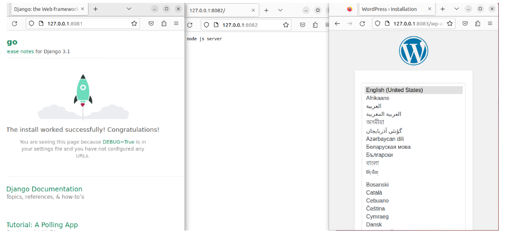

# Динамический веб

> Создадим папку проект project mdkir project&&cd project
> Создадим файл .env с переменными необходимыми для базы данных, wordpress и python приложения.

> .env

```
# Переменные которые будут использоваться для создания и подключения БД
DB_NAME=wordpress 
DB_ROOT_PASSWORD=dbpassword 
# Переменные необходимые python приложению
MYSITE_SECRET_KEY=put_your_django_app_secret_key_here
DEBUG=True
```
# Приложение NODE.js

> Создадим папку приложения node mkdir node и файл node.js

> Node.js

```
const http = require('http');
const hostname = '0.0.0.0';
const port = 3000;

const server = http.createServer((req, res) => {
    res.statusCode = 200;
    res.setHeader('Content-Type', 'text/plain');
    res.end('Hello from node js server');
});

server.listen(port, hostname, () => {
    console.log(`Server running at http://${hostname}:${port}/`);
});
```

> Создадим docker-compose.yml

```
version: '3'
services:
  node:
      image: node:16.13.2-alpine3.15
      container_name: node
      working_dir: /opt/server # переназначим рабочую директорию для удобства
      volumes:
        - ./node:/opt/server # пробрасываем приложение в директорию контейнера
      command: node test.js # запуск приложения
      networks:
        - app-network
```


# Приложение APP (Django)

> Создадим папки python, mysite mkdir -p ./python/mysite
> Создадим manage.py


```
#!/usr/bin/env python
"""Django's command-line utility for administrative tasks."""
import os
import sys

def main():
    """Run administrative tasks."""
    os.environ.setdefault('DJANGO_SETTINGS_MODULE', 'mysite.settings')
    try:
        from django.core.management import execute_from_command_line
    except ImportError as exc:
        raise ImportError(
            "Couldn't import Django. Are you sure it's installed and "
            "available on your PYTHONPATH environment variable? Did you "
            "forget to activate a virtual environment?"
        ) from exc
    execute_from_command_line(sys.argv)

if __name__ == '__main__':
    main()
```

> Перейдем в директорию cd mysite и создадим файлы:

> settings.py

```
import os
import ast
from pathlib import Path

BASE_DIR = Path(__file__).resolve(strict=True).parent.parent
SECRET_KEY = os.getenv('MYSITE_SECRET_KEY', '')
DEBUG = ast.literal_eval(os.getenv('DEBUG', 'True'))
ALLOWED_HOSTS = []
INSTALLED_APPS = [
    'django.contrib.admin',
    'django.contrib.auth',
    'django.contrib.contenttypes',
    'django.contrib.sessions',
    'django.contrib.messages',
    'django.contrib.staticfiles',
]

MIDDLEWARE = [
    'django.middleware.security.SecurityMiddleware',
    'django.contrib.sessions.middleware.SessionMiddleware',
    'django.middleware.common.CommonMiddleware',
    'django.middleware.csrf.CsrfViewMiddleware',
    'django.contrib.auth.middleware.AuthenticationMiddleware',
    'django.contrib.messages.middleware.MessageMiddleware',
    'django.middleware.clickjacking.XFrameOptionsMiddleware',
]

ROOT_URLCONF = 'mysite.urls'

TEMPLATES = [
    {
        'BACKEND': 'django.template.backends.django.DjangoTemplates',
        'DIRS': [],
        'APP_DIRS': True,
        'OPTIONS': {
            'context_processors': [
                'django.template.context_processors.debug',
                'django.template.context_processors.request',
                'django.contrib.auth.context_processors.auth',
                'django.contrib.messages.context_processors.messages',
            ],
        },
    },
]

WSGI_APPLICATION = 'mysite.wsgi.application'
DATABASES = {
    'default': {
        'ENGINE': 'django.db.backends.sqlite3',
        'NAME': BASE_DIR / 'db.sqlite3',
    }
}
AUTH_PASSWORD_VALIDATORS = [
    {
        'NAME': 'django.contrib.auth.password_validation.UserAttributeSimilarityValidator',
    },
    {
        'NAME': 'django.contrib.auth.password_validation.MinimumLengthValidator',
    },
    {
        'NAME': 'django.contrib.auth.password_validation.CommonPasswordValidator',
    },
    {
        'NAME': 'django.contrib.auth.password_validation.NumericPasswordValidator',
    },
]
LANGUAGE_CODE = 'en-us'
TIME_ZONE = 'UTC'
USE_I18N = True
USE_L10N = True
USE_TZ = True
STATIC_URL = '/static/'
```

> urls.py

```
from django.contrib import admin
from django.urls import path

urlpatterns = [
    path('admin/', admin.site.urls),
]
```

> wsgi.py

```
import os
from django.core.wsgi import get_wsgi_application

os.environ.setdefault('DJANGO_SETTINGS_MODULE', 'mysite.settings')
application = get_wsgi_application()
```

> Перейдем в каталог выше (python) cd .. и создадим Dockerfile для сборки контейнера

> Dockerfile

```
FROM python:3.8.3
ENV APP_ROOT /src
ENV CONFIG_ROOT /config
RUN mkdir ${CONFIG_ROOT}
COPY requirements.txt ${CONFIG_ROOT}/requirements.txt
RUN pip install -r ${CONFIG_ROOT}/requirements.txt
RUN mkdir ${APP_ROOT}
WORKDIR ${APP_ROOT}
ADD . ${APP_ROOT}
```

> Создадим файл requirements.txt

> requirements.txt

```
Django==3.1
gunicorn==20.0.4
pytz==2020.1
```

> Добавим в docker-compose.yml

```
app:
      build: ./python # для нашего приложения нужны зависимости, поэтому собираем свой образ 
      container_name: app
      restart: always
      env_file:
        - .env # импортируем в контейнер переменные из .env
      command:
        "gunicorn --workers=2 --bind=0.0.0.0:8000 mysite.wsgi:application" # команда для запуска django проекта, приложение будет работать на 8000 порту контейнера
      networks:
        - app-network
```

# База данных MySql

> Добавим в docker-compose.yml

```
database:
      image: mysql:8.0
      container_name: database
      restart: unless-stopped
      environment:
        MYSQL_DATABASE: ${DB_NAME}
        MYSQL_ROOT_PASSWORD: ${DB_ROOT_PASSWORD}
      volumes:
        - ./dbdata:/var/lib/mysql
      command: '--default-authentication-plugin=mysql_native_password'
      networks:
        - app-network
```

# Приложение WORDPRESS

```
wordpress:
      image: wordpress:5.1.1-fpm-alpine # официальный образ от разработчиков
      container_name: wordpress
      restart: unless-stopped
  # на странице образа в docker hub написано, какие можно задать переменные контейнеру https://hub.docker.com/_/wordpress
      environment:
        WORDPRESS_DB_HOST: database
        WORDPRESS_DB_NAME: "${DB_NAME}" # Также импортируем переменные из .env
        WORDPRESS_DB_USER: root
        WORDPRESS_DB_PASSWORD: "${DB_ROOT_PASSWORD}"
      volumes:
        - ./wordpress:/var/www/html # сохраняем приложение на хост машине
      networks:
        - app-network
      depends_on:
        - database # контейнер wordpress дождется запуска БД
```

# NGINX для проксирования веб приложений

> Создадим папку nginx-conf mkdir nginx-conf и файл nginx.conf в этой папке.

> nginx.conf

```
# Данный сервер отвечает за проксирование на wordpress через fastcgi
server {
# Wordpress будет отображаться на 8083 порту хоста
        listen 8083;
        listen [::]:8083;
        server_name localhost;
        index index.php index.html index.htm;

# Задаем корень корень проекта, куда мы смонтировали статику wordpress
        root /var/www/html;
        location ~ /.well-known/acme-challenge {
                allow all;
                root /var/www/html;
        }
        location / {
                try_files $uri $uri/ /index.php$is_args$args;
        }
# Само fastcgi проксирование в контейнер с wordpress по 9000 порту
        location ~ \.php$ {
                try_files $uri =404;
                fastcgi_split_path_info ^(.+\.php)(/.+)$;
                fastcgi_pass wordpress:9000;
                fastcgi_index index.php;
                include fastcgi_params;
                fastcgi_param SCRIPT_FILENAME $document_root$fastcgi_script_name;
                fastcgi_param PATH_INFO $fastcgi_path_info;
        }

        location = /favicon.ico {
                log_not_found off; access_log off;
        }

        location ~* \.(css|gif|ico|jpeg|jpg|js|png)$ {
                expires max;
                log_not_found off;
        }
}

upstream django {
  server app:8000;
}
server {
# Django будет отображаться на 8081 порту хоста
   listen 8081;
   listen [::]:8081;   
   server_name localhost;
  location / {
    try_files $uri @proxy_to_app;
  }
# тут используем обычное проксирование в контейнер django
  location @proxy_to_app {
    proxy_pass http://django;
    proxy_http_version 1.1;
    proxy_set_header Upgrade $http_upgrade;
    proxy_set_header Connection "upgrade";
    proxy_redirect off;
    proxy_set_header Host $host;
    proxy_set_header X-Real-IP $remote_addr;
    proxy_set_header X-Forwarded-For $proxy_add_x_forwarded_for;
    proxy_set_header X-Forwarded-Host $server_name;
  }
}

# Node.js будет отображаться на 8082 порту хоста
server {
   listen 8082;
   listen [::]:8082;   
   server_name localhost;
  location / {
    proxy_pass http://node:3000;
    proxy_http_version 1.1;
    proxy_set_header Upgrade $http_upgrade;
    proxy_set_header Connection "upgrade";
    proxy_redirect off;
    proxy_set_header Host $host;
    proxy_set_header X-Real-IP $remote_addr;
    proxy_set_header X-Forwarded-For $proxy_add_x_forwarded_for;
    proxy_set_header X-Forwarded-Host $server_name;
  }
}
```

> Добавим в docker-compose.yml

```
 nginx:
      image: nginx:1.15.12-alpine
      container_name: nginx
      restart: unless-stopped
  # Т.к. все запросы к приложениям будут проходить через nginx, пробросим под каждое приложение по порту.
      ports:
        - 8083:8083
        - 8081:8081
        - 8082:8082
      volumes:
  # будет использоваться php-fpm, необходимо смонтировать статические файлы wordpress :
        - ./wordpress:/var/www/html
        - ./nginx-conf:/etc/nginx/conf.d # монтируем конфиг
      networks:
        - app-network
      depends_on: # nginx будет запускаться после всех приложений
        - wordpress
        - app
        - node
```

# Добавим сеть networks в docker-compose.yml

```
networks:
  app-network:
    driver: bridge
```

# Ansible provision

> Создадим файл hosts ( верхний каталог )

> hosts

```
DynamicWeb ansible_host=127.0.0.1 ansible_user=vagrant ansible_port=2222 ansible_ssh_private_key_file=.vagrant/machines/DynamicWeb/virtualbox/private_key
```

> Создададим prov.yml для установки программ необходимы для запуска контейнеров и docker-compose.

> prov.yml

```
---
- name: Install Dynamic Web Application
  hosts: DynamicWeb # имя хоста, который мы создадим Vagrant`om
  become: yes # Установка Docker через sudo
  gather_facts: false
  tasks: # Перечисляем задачи которые выполнит наш playbook
    - name: Install docker packages # устанавливаем пакеты необходимые для установки докера
      become: yes
      apt:
        name: "{{ item }}"
        state: present
        update_cache: yes
      with_items:
        - apt-transport-https
        - ca-certificates
        - curl
        - software-properties-common
      tags:
        - docker
    - name: Add Docker s official GPG key
      become: yes
      apt_key:
        url: https://download.docker.com/linux/ubuntu/gpg
        state: present
      tags:
        - docker
  
    - name: Verify that we have the key with the fingerprint
      become: yes    
      apt_key:
        id: 0EBFCD88
        state: present
      tags:
        - docker
    - name: Set up the stable repository # добавляем репозиторий докера
      become: yes    
      apt_repository:
        repo: deb [arch=amd64] https://download.docker.com/linux/ubuntu xenial stable
        state: present
        update_cache: yes
      tags:
        - docker
    
    - name: Update apt packages
      become: yes    
      apt:
        update_cache: yes
      tags:
        - docker
    - name: Install docker # установка докера
      become: yes    
      apt:
        name: docker-ce
        state: present
        update_cache: yes
      tags:
        - docker
    - name: Add remote "vagrant" user to "docker" group
      become: yes
      user:
        name: vagrant
        group: "docker"
        append: yes
      tags:
       - docker
  
    - name: Install docker-compose 
      become: yes
      get_url:
        url : https://github.com/docker/compose/releases/download/1.25.1-rc1/docker-compose-Linux-x86_64
        dest: /usr/local/bin/docker-compose
        mode: 0777
    - name: Copy project # Копируем проект с хост машины в созданную через vagrant
      copy: src=project dest=/home/vagrant
    - name: reset ssh connection # чтобы применились права на использование docker, необходимо перелогиниться
      meta: reset_connection
    - name: Run container
      shell:
        cmd: "docker-compose -f docker-compose.yml up -d"
        chdir: /home/vagrant/project
```

# Создание Vagrantfile

> Vagrantfile

```
Vagrant.configure(2) do |config|

    config.vm.provision "ansible" do |ansible|
       ansible.playbook = "prov.yml"
       ansible.inventory_path = "hosts"
       ansible.host_key_checking = "false"
     end
  
     config.vm.define "DynamicWeb" do |vmconfig| 
      vmconfig.vm.box = 'bento/ubuntu-20.04'
      vmconfig.vm.hostname = 'DynamicWeb'

      vmconfig.vm.network "forwarded_port", guest: 8083, host: 8083
      vmconfig.vm.network "forwarded_port", guest: 8081, host: 8081
      vmconfig.vm.network "forwarded_port", guest: 8082, host: 8082
      vmconfig.vm.provider "virtualbox" do |vbx|
       vbx.memory = "2048"
       vbx.cpus = "2"
       vbx.customize ["modifyvm", :id, '--audio', 'none']
      end
     end
  
  end
```

# Запуск и тестирование

> Запустим создание виртуальной машины и убедимся, что все контейнеры запустились и все приложения доступны.

```
vagrant up
vagrant ssh
cd project
docker-compose ps
```

```
vagrant@DynamicWeb:~/project$ docker-compose ps
  Name                 Command               State                                                                  Ports                                                                
-----------------------------------------------------------------------------------------------------------------------------------------------------------------------------------------
app         gunicorn --workers=2 --bin ...   Up                                                                                                                                          
database    docker-entrypoint.sh --def ...   Up      3306/tcp, 33060/tcp                                                                                                                 
nginx       nginx -g daemon off;             Up      80/tcp, 0.0.0.0:8081->8081/tcp,:::8081->8081/tcp, 0.0.0.0:8082->8082/tcp,:::8082->8082/tcp, 0.0.0.0:8083->8083/tcp,:::8083->8083/tcp
node        docker-entrypoint.sh node  ...   Up                                                                                                                                          
wordpress   docker-entrypoint.sh php-fpm     Up      9000/tcp
```

> Для проверки подключимся к 127.0.0.1:8081 127.0.0.1:8082 127.0.0.1:8083


>  


> Как видим все открывается